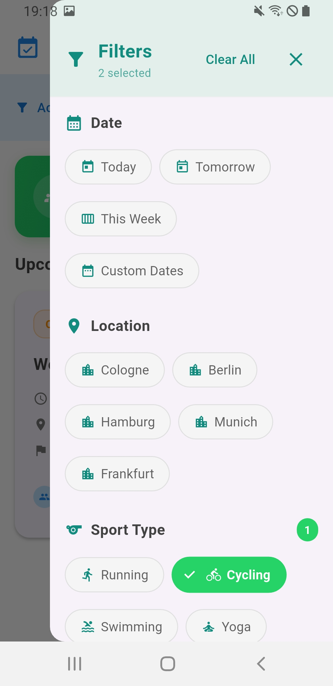
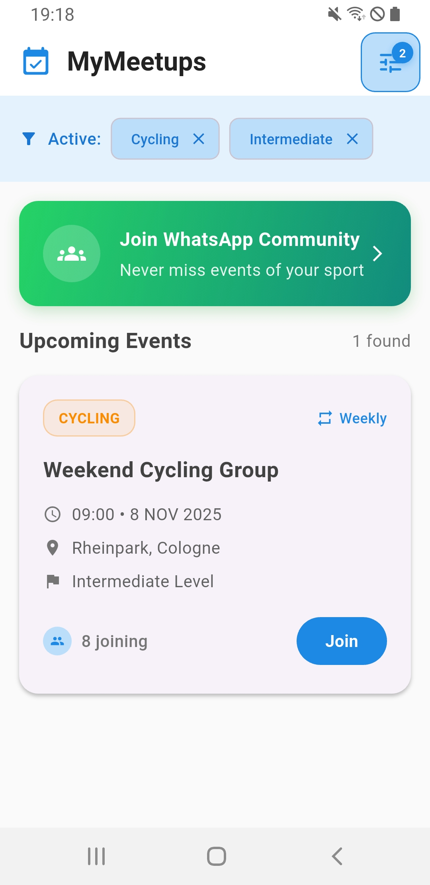

# MyMeetups App

A modern Flutter application for discovering and filtering sports meetups.

## Features
- 🎯 Advanced filtering system (date, location, sport type, difficulty)
- 📅 Real calendar integration for date selection
- 💬 WhatsApp community integration
- 🎨 Modern, clean UI design
- 📱 Responsive design for all screen sizes

## Screens
- Meetup list with filtering
- Detailed filter drawer
- WhatsApp community card
- Modern card-based layout
- 
## 📱 Screenshots

### Filter Drawer

### Active Filters

##  Tech Stack

- **Framework**: Flutter
- **State Management**: Provider + ChangeNotifier
- **Architecture**: Clean Architecture
- **Calendar**: table_calendar
- **Styling**: Material Design 3

## Setup Instructions

1. Extract the zip file
2. Open in Android Studio/VSCode
3. Run `flutter pub get`
4. Run `flutter run`

## Project Structure
